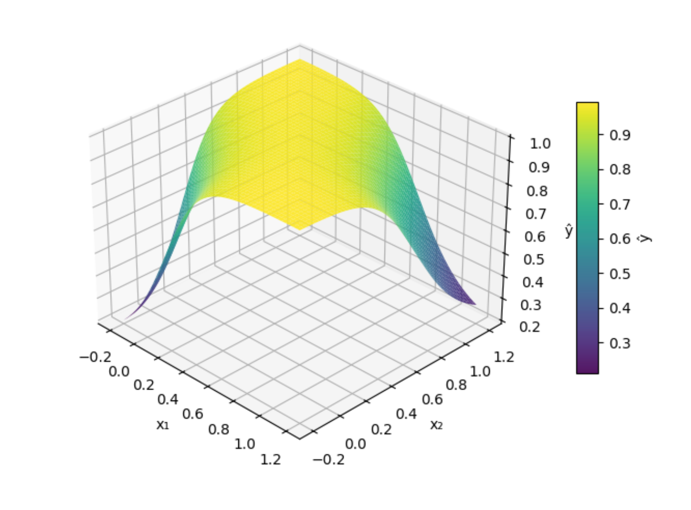
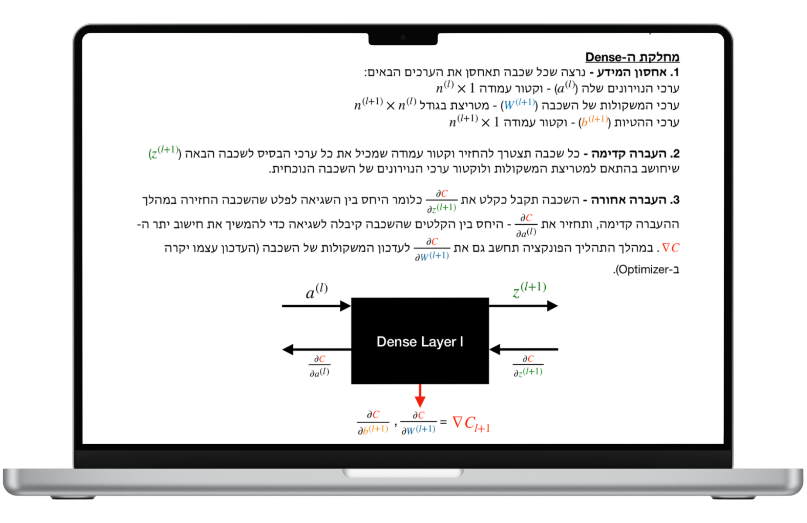

# Neural Network from Scratch - XOR Problem Implementation

## Project Purpose & Overview
This project was driven by a curiosity to understand how neural networks operate “behind the scenes,” and it offers a deep dive into the structural and mathematical foundations of deep learning. The goal was to explore the implementation of neural networks by building a fully functional multi-layer neural network from scratch using only **Python** and **NumPy**, without relying on external deep learning libraries such as PyTorch. 

### Technical Highlights
* **Modular OOP Architecture**: The system is designed with a clear separation between layers, activation functions, and network management, allowing for easy extensibility.
* **Manual Backpropagation**: Implements the backpropagation algorithm using the **Chain Rule** to calculate gradients and update weights and biases across all layers.
* **Operational Flexibility**: The modular design supports various activation functions (e.g., Tanh, Sigmoid, ReLU) and loss functions (e.g., MSE, Binary Cross-Entropy).
* **Non-Linear Problem Solving**: Successfully solves the XOR problem, demonstrating the model's ability to learn non-linear decision boundaries through hidden layers.

### Results
When trained on the XOR problem, the model achieved:
* **Confidence Level**: 99.2%
* **Final Training Loss (MSE)**: 0.0002

*Figure: The learned decision surface showing the non-linear separation for the XOR gates.*

---

## Full Detailed Guide Table of Contents
1. **Mathematical Foundations and Notation**
2. **Inference Process: Forward Propagation**
3. **Performance Measurement and Optimization**
4. **The Learning Mechanism: Backpropagation**
5. **Software Architecture and Implementation**
6. **Evaluation: XOR Solution and Run Examples**

---

## Detailed Guide
For a comprehensive walkthrough of the mathematics and logic behind this project, please refer to the [Detailed Guide Hebrew (PDF)](./Detailed%20Guide%20Hebrew.pdf).

  

